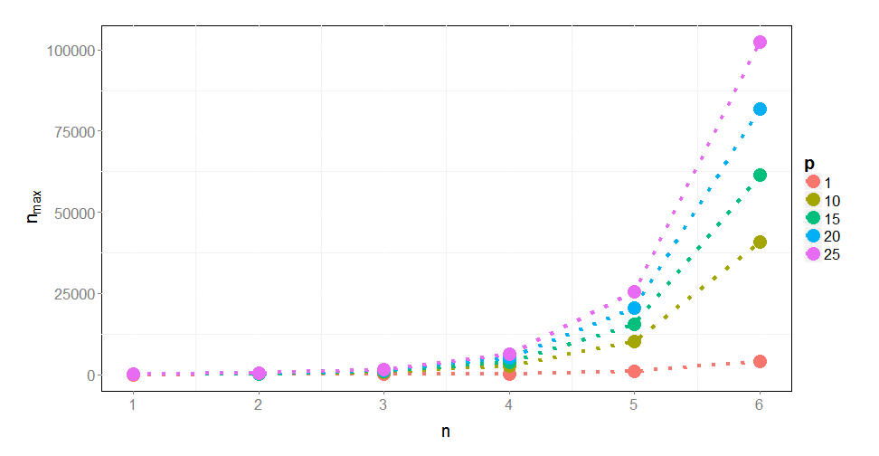

### Outline

1. n-gram definition.
2. Iterative n-gram building.
3. Results.
4. Drawbacks and limitations.

--- 

### n-grams (k-mers)

n-grams (k-tuples) are vectors of n characters derived from input sequence(s). They may form continuous sub-sequences or be discontinuous.  

Important n-gram parameter is its position. Instead of just counting n-grams, one may want to count how many n-grams occur at a given position in multiple (e.g. related) sequences.

--- 

### 1-grams

<!-- html table generated in R 3.1.3 by xtable 1.7-4 package -->
<!-- Sun Apr 19 23:49:33 2015 -->
<table border=1>
<caption align="bottom"> Sample sequences.  S - sequence, P - position. </caption>
<tr> <th>  </th> <th> P1 </th> <th> P2 </th> <th> P3 </th> <th> P4 </th> <th> P5 </th> <th> P6 </th>  </tr>
  <tr> <td align="right"> S1 </td> <td> A </td> <td> T </td> <td> T </td> <td> C </td> <td> A </td> <td> T </td> </tr>
  <tr> <td align="right"> S2 </td> <td> A </td> <td> T </td> <td> A </td> <td> G </td> <td> G </td> <td> T </td> </tr>
  <tr> <td align="right"> S3 </td> <td> G </td> <td> C </td> <td> A </td> <td> C </td> <td> C </td> <td> T </td> </tr>
   </table>
  
&nbsp;
  
<!-- html table generated in R 3.1.3 by xtable 1.7-4 package -->
<!-- Sun Apr 19 22:06:41 2015 -->
<table border=1>
<caption align="bottom"> 1-gram counts. </caption>
<tr> <th>  </th> <th> A </th> <th> C </th> <th> G </th> <th> T </th>  </tr>
  <tr> <td align="right"> S1 </td> <td align="right"> 1 </td> <td align="right"> 2 </td> <td align="right"> 1 </td> <td align="right"> 2 </td> </tr>
  <tr> <td align="right"> S2 </td> <td align="right"> 2 </td> <td align="right"> 2 </td> <td align="right"> 2 </td> <td align="right"> 0 </td> </tr>
  <tr> <td align="right"> S3 </td> <td align="right"> 1 </td> <td align="right"> 0 </td> <td align="right"> 2 </td> <td align="right"> 3 </td> </tr>
   </table>

--- 

### 2-grams

<!-- html table generated in R 3.1.3 by xtable 1.7-4 package -->
<!-- Sun Apr 19 23:49:33 2015 -->
<table border=1>
<caption align="bottom"> Sample sequences.  S - sequence, P - position. </caption>
<tr> <th>  </th> <th> P1 </th> <th> P2 </th> <th> P3 </th> <th> P4 </th> <th> P5 </th> <th> P6 </th>  </tr>
  <tr> <td align="right"> S1 </td> <td> A </td> <td> T </td> <td> T </td> <td> C </td> <td> A </td> <td> T </td> </tr>
  <tr> <td align="right"> S2 </td> <td> A </td> <td> T </td> <td> A </td> <td> G </td> <td> G </td> <td> T </td> </tr>
  <tr> <td align="right"> S3 </td> <td> G </td> <td> C </td> <td> A </td> <td> C </td> <td> C </td> <td> T </td> </tr>
   </table>
  
&nbsp;
  
<!-- html table generated in R 3.1.3 by xtable 1.7-4 package -->
<!-- Sun Apr 19 22:10:08 2015 -->
<table border=1>
<caption align="bottom"> 2-gram counts. </caption>
<tr> <th>  </th> <th> AA </th> <th> CA </th> <th> GA </th> <th> TA </th> <th> AC </th> <th> CC </th> <th> GC </th> <th> TC </th> <th> AG </th> <th> CG </th> <th> GG </th> <th> TG </th> <th> AT </th> <th> CT </th> <th> GT </th> <th> TT </th>  </tr>
  <tr> <td align="right"> S1 </td> <td align="right"> 0 </td> <td align="right"> 0 </td> <td align="right"> 0 </td> <td align="right"> 1 </td> <td align="right"> 0 </td> <td align="right"> 0 </td> <td align="right"> 1 </td> <td align="right"> 0 </td> <td align="right"> 1 </td> <td align="right"> 0 </td> <td align="right"> 0 </td> <td align="right"> 0 </td> <td align="right"> 0 </td> <td align="right"> 1 </td> <td align="right"> 0 </td> <td align="right"> 1 </td> </tr>
  <tr> <td align="right"> S2 </td> <td align="right"> 0 </td> <td align="right"> 1 </td> <td align="right"> 1 </td> <td align="right"> 0 </td> <td align="right"> 1 </td> <td align="right"> 0 </td> <td align="right"> 0 </td> <td align="right"> 0 </td> <td align="right"> 1 </td> <td align="right"> 1 </td> <td align="right"> 0 </td> <td align="right"> 0 </td> <td align="right"> 0 </td> <td align="right"> 0 </td> <td align="right"> 0 </td> <td align="right"> 0 </td> </tr>
  <tr> <td align="right"> S3 </td> <td align="right"> 0 </td> <td align="right"> 0 </td> <td align="right"> 1 </td> <td align="right"> 0 </td> <td align="right"> 0 </td> <td align="right"> 0 </td> <td align="right"> 0 </td> <td align="right"> 0 </td> <td align="right"> 0 </td> <td align="right"> 0 </td> <td align="right"> 0 </td> <td align="right"> 1 </td> <td align="right"> 1 </td> <td align="right"> 0 </td> <td align="right"> 1 </td> <td align="right"> 1 </td> </tr>
   </table>

--- 

### 2-grams with position information

<!-- html table generated in R 3.1.3 by xtable 1.7-4 package -->
<!-- Sun Apr 19 23:49:33 2015 -->
<table border=1>
<caption align="bottom"> Sample sequences.  S - sequence, P - position. </caption>
<tr> <th>  </th> <th> P1 </th> <th> P2 </th> <th> P3 </th> <th> P4 </th> <th> P5 </th> <th> P6 </th>  </tr>
  <tr> <td align="right"> S1 </td> <td> A </td> <td> T </td> <td> T </td> <td> C </td> <td> A </td> <td> T </td> </tr>
  <tr> <td align="right"> S2 </td> <td> A </td> <td> T </td> <td> A </td> <td> G </td> <td> G </td> <td> T </td> </tr>
  <tr> <td align="right"> S3 </td> <td> G </td> <td> C </td> <td> A </td> <td> C </td> <td> C </td> <td> T </td> </tr>
   </table>
  
&nbsp;
  
<!-- html table generated in R 3.1.3 by xtable 1.7-4 package -->
<!-- Sun Apr 19 22:27:57 2015 -->
<table border=1>
<caption align="bottom"> 2-gram counts. </caption>
<tr> <th>  </th> <th> X1_A.A_0 </th> <th> X2_A.A_0 </th> <th> X3_A.A_0 </th> <th> X4_A.A_0 </th> <th> X5_A.A_0 </th> <th> X1_C.A_0 </th> <th> X2_C.A_0 </th> <th> X3_C.A_0 </th>  </tr>
  <tr> <td align="right"> S1 </td> <td align="right"> 0 </td> <td align="right"> 0 </td> <td align="right"> 0 </td> <td align="right"> 0 </td> <td align="right"> 1 </td> <td align="right"> 0 </td> <td align="right"> 0 </td> <td align="right"> 0 </td> </tr>
  <tr> <td align="right"> S2 </td> <td align="right"> 0 </td> <td align="right"> 0 </td> <td align="right"> 0 </td> <td align="right"> 0 </td> <td align="right"> 1 </td> <td align="right"> 0 </td> <td align="right"> 0 </td> <td align="right"> 0 </td> </tr>
  <tr> <td align="right"> S3 </td> <td align="right"> 0 </td> <td align="right"> 0 </td> <td align="right"> 0 </td> <td align="right"> 0 </td> <td align="right"> 0 </td> <td align="right"> 0 </td> <td align="right"> 1 </td> <td align="right"> 0 </td> </tr>
   </table>

--- 

### Curse of dimensionality

$$n_{\text{max}} = p \times m^n$$

$n_{\text{max}}$: total number of n-grams.

$p$: number of possible positions.

$m$: number of letters in the alphabet.

--- 

### Curse of dimensionality

$$n_{\text{max}} = p \times m^n$$

 

---

### Iterative n-gram building

Reason: there are too many possible n-grams. For bigger values of $n$ feature filtering takes too long.

---

### Exact n-gram building algorithm 

1. Extract 1-grams from sequences and filter them.
2. Split n-grams into 1-grams.
3. Join together 1-grams with n-grams in all possible combinations.
4. Filter ($n+1$)-grams.
5. Repeat steps 2-4 till the given value of $n$ or there are no significant n-grams.

---

### Example: exact n-gram building algorithm 

  
<!-- html table generated in R 3.1.3 by xtable 1.7-4 package -->
<!-- Mon Apr 20 00:12:14 2015 -->
<table border=1>
<caption align="bottom"> Filtered 2-grams. </caption>
  <tr> <td align="right"> biogram notation </td> <td> 1_A.T_0 </td> <td> 2_T.T_0 </td> <td> 3_T.C_0 </td> </tr>
  <tr> <td align="right"> human-readable </td> <td> AT </td> <td> TT </td> <td> TC </td> </tr>
   </table>

&nbsp;

<!-- html table generated in R 3.1.3 by xtable 1.7-4 package -->
<!-- Mon Apr 20 00:12:21 2015 -->
<table border=1>
<caption align="bottom"> Possible 3-grams. </caption>
  <tr> <td align="right"> biogram notation </td> <td> 1_A.T.T_0.0 </td> <td> 1_A.T.C_1.0 </td> <td> 2_T.T.C_0.0 </td> <td> 1_A.T.T_0.0 </td> <td> 1_A.T.C_0.1 </td> <td> 2_T.T.C_0.0 </td> </tr>
  <tr> <td align="right"> human-readable </td> <td> ATT </td> <td> A_TC </td> <td> TTC </td> <td> ATT </td> <td> AT_C </td> <td> TTC </td> </tr>
   </table>

---

### n-gram building algorithm with Hamming distance

1. Extract 1-grams from sequences and filter them.
2. Split n-grams into 1-grams.
3. Join together 1-grams with n-grams in all possible combinations.
4. Create summary feature for each ($n+1$)-gram. A summary feature is a logical alternative of counts for all positioned n-gram which are in given Hamming distance from a ($n+1$)-gram.
5. Filter summary features.
6. Repeat steps 2-5 till the given value of $n$ or there are no significant n-grams.

---

### Example: exact n-gram building algorithm 

  
<!-- html table generated in R 3.1.3 by xtable 1.7-4 package -->
<!-- Mon Apr 20 00:51:00 2015 -->
<table border=1>
<caption align="bottom"> Filtered 2-grams. </caption>
  <tr> <td align="right"> biogram notation </td> <td> 1_A.T_0 </td> <td> 2_T.T_0 </td> <td> 3_T.C_0 </td> </tr>
  <tr> <td align="right"> human-readable </td> <td> AT </td> <td> TT </td> <td> TC </td> </tr>
   </table>

&nbsp;

<!-- html table generated in R 3.1.3 by xtable 1.7-4 package -->
<!-- Mon Apr 20 00:51:00 2015 -->
<table border=1>
<caption align="bottom"> Possible 3-grams. </caption>
  <tr> <td align="right"> biogram notation </td> <td> 1_A.T.T_0.0 </td> <td> 1_A.T.C_1.0 </td> <td> 2_T.T.C_0.0 </td> <td> 1_A.T.T_0.0 </td> <td> 1_A.T.C_0.1 </td> <td> 2_T.T.C_0.0 </td> </tr>
  <tr> <td align="right"> human-readable </td> <td> ATT </td> <td> A_TC </td> <td> TTC </td> <td> ATT </td> <td> AT_C </td> <td> TTC </td> </tr>
   </table>

&nbsp;

<!-- html table generated in R 3.1.3 by xtable 1.7-4 package -->
<!-- Mon Apr 20 00:55:42 2015 -->
<table border=1>
<caption align="bottom"> n-grams in the Hamming distance 1 from n-gram 1_A.T.T_0.0 (ATT). </caption>
  <tr> <td align="right"> biogram notation </td> <td> 2_T.T_0 </td> <td> 1_A.T_1 </td> <td> 1_A.T_0 </td> </tr>
  <tr> <td align="right"> human-readable </td> <td> TT </td> <td> A_T </td> <td> AT </td> </tr>
   </table>

---

### Results

Average AUC is around 0.51 for constructed 3- and 4-gram. Same as for non-constructed 3- and 4-grams (filtered all possible 3- and 4-grams without any distance between elements).

---

### Drawbacks and limitations

Drawbacks:
* iteratively built n-grams do not provide more information about the differences between sequences;
* constructing n-grams is slow.

Limitations
* bottleneck: counting constructed n-grams in sequences;
* impossible to insert unigram between elements of n-gram.
* heavy emphasis on position severily restricts the algorithm.

