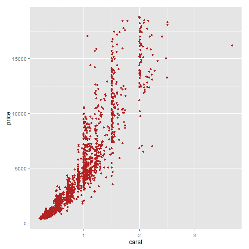
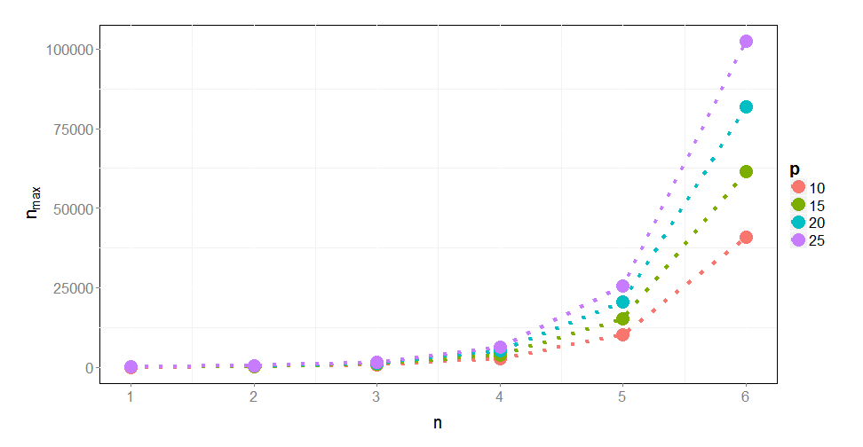

### Quick example with ggplot2

 

--- 

### Curse of dimensionality

$$n_{\text{max}} = p \times m^n$$

$n_{\text{max}}$: total number of n-grams.

$p$: number of possible positions.

$m$: number of letters in the alphabet.

--- 

### Curse of dimensionality

$$n_{\text{max}} = p \times m^n$$

 

---

### More stuff

AAAAAA
